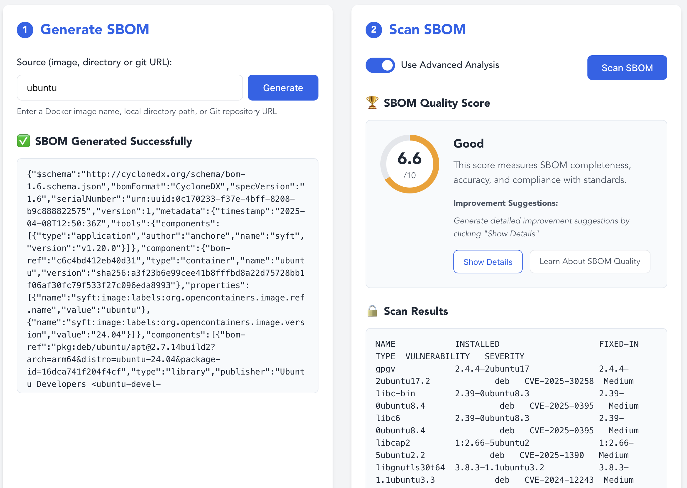
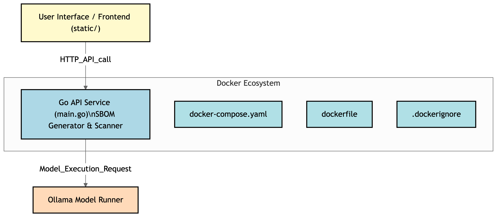

# AI-Powered SBOM Generator




This project provides an AI-powered Software Bill of Materials (SBOM) generator.



## Current Features

*   **Ollama Integration:** Supports generating SBOMs using the Ollama model runner.
*   **Docker Compose Support:** Can be easily deployed and run using Docker Compose.
*   **Vue.js Frontend:** Modern, responsive user interface built with Vue.js.
*   **Docker Model Runner (Planned):** Future support for running models directly within Docker.

## Prerequisites

*  ollama running locally 
*  Docker Docker and Docker Compose installed.

## Installation and Setup

1.  **Clone the Repository:**
    ```bash
    git clone https://github.com/sangam14/syft-api
    cd syft-api
    ```

2.  **Build the Docker Images:**
    ```bash
    docker compose build --no-cache
    ```

3.  **Start the Application:**
    ```bash
    docker compose up
    ```

## Usage

This tool can scan various sources to generate SBOMs:

*   **Docker Images:** Analyze existing Docker images.
*   **Directories:** Scan local directories for software components.
*   **GitHub Repositories:** Generate SBOMs from GitHub repositories.

## Accessing the Application

The application is available at:

* **Backend API & HTML Interface:** [http://localhost:3000](http://localhost:3000)
* **Vue.js Frontend (Development):** [http://localhost:8080](http://localhost:8080)

## Frontend Development

The project includes a Vue.js frontend located in the `static/vue-frontend` directory.

### Running the Vue.js Frontend

```bash
# Navigate to the Vue.js frontend directory
cd static/vue-frontend

# Install dependencies
npm install

# Start the development server
npm run serve
```

### Building for Production

```bash
# Build the Vue.js frontend
cd static/vue-frontend
npm run build

# The built files will be placed in the static/dist directory
# You can integrate them with the backend using the provided script
./build-and-integrate.sh
```

### Using Docker for Frontend Development

```bash
# Run the Vue.js frontend in development mode
cd static/vue-frontend
docker-compose up
```

### Running Both Backend and Frontend

A combined Docker Compose file is provided to run both services:

```bash
docker-compose -f docker-compose.full.yaml up
```

## Future Enhancements

*   Docker Model Runner support.
*   More model support.
*   More source support.
*   More output formats.

## Contributing

Contributions to this project are welcome! Please see the CONTRIBUTING.md file for guidelines on how to contribute.
